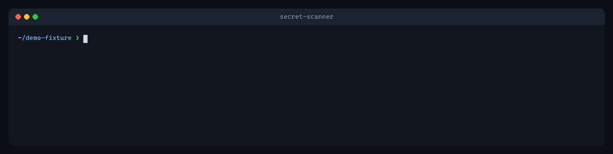
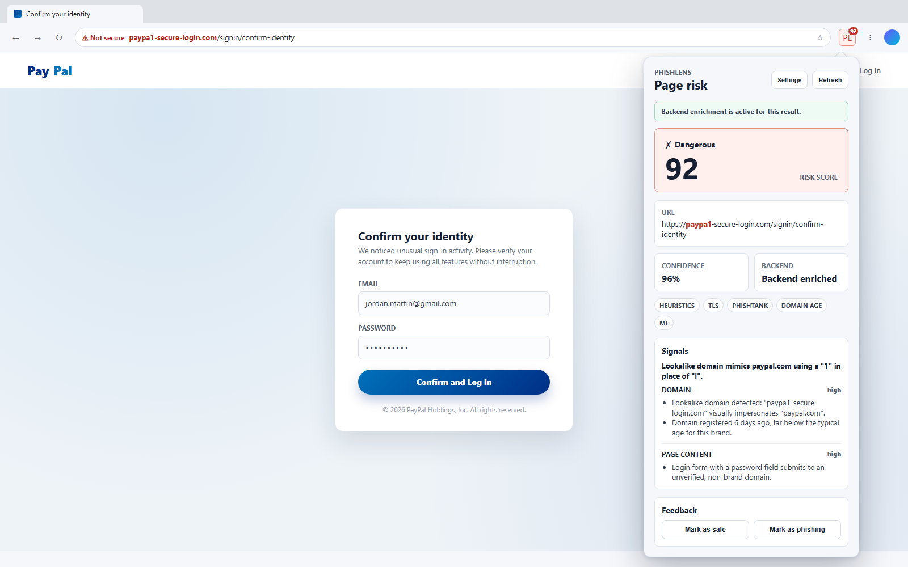
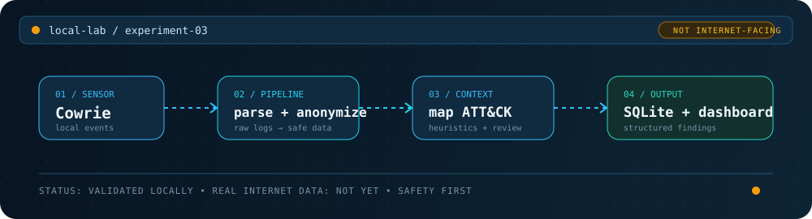

<picture>
  <source media="(prefers-color-scheme: dark)" srcset="assets/profile-header-dark.svg">
  <source media="(prefers-color-scheme: light)" srcset="assets/profile-header-light.svg">
  
</picture>

# Hi, I'm Juan 👋

**Backend engineering with a security mindset — and a healthy curiosity for how things break.**

I have been curious about computers since I built my first PC at 13. These days, that curiosity goes into backends, APIs, automation, and defensive tools—the kind that catch problems early and explain what happened.

I am finishing my Software Engineering degree in Seville, Spain, and working towards a junior backend role where I can keep building useful things and asking good questions.

📍 **Seville, Spain** · 🎓 **Finishing Software Engineering** · 🛠️ **Currently building defensive tools**

[Portfolio](https://juancardesa.dev) · [LinkedIn](https://www.linkedin.com/in/juan-cardesa-sosa-a39623258/) · [My flagship project](https://github.com/JuanCardesa/secret-scanner-cli)

## A little more about me

- I like the point where backend logic, automation, and security meet.
- I enjoy taking systems apart mentally: finding the assumption, the edge case, or the thing that quietly fails.
- I want my projects to be useful, explain what they are doing, and be honest about what they cannot do yet.

## Things I've been building

### 🔐 The one that looks for secrets

#### [Secret Scanner CLI](https://github.com/JuanCardesa/secret-scanner-cli) · my flagship project

  

A secret removed from the latest file can still be sitting in Git history. I built this defensive Python CLI to scan GitHub repositories and organizations through the API—without cloning them—as well as local code and recent commits.

It combines provider patterns with entropy analysis, redacts matches before reporting, and can produce terminal, JSON, HTML, or SARIF output. It also works as a CI gate, pre-commit hook, reusable GitHub Action, and published [PyPI package](https://pypi.org/project/cardesa-secret-scanner/).

`Python` `GitHub API` `asyncio` `SARIF` `pytest` `GitHub Actions`

### 🔎 The one that explains suspicious pages

#### [PhishLens](https://github.com/JuanCardesa/PhishLens)

  

I wanted a phishing assistant that did more than flash a red warning. PhishLens explains *why* a page looks risky by combining URL and privacy-preserving DOM signals with optional threat intelligence, TLS, domain-age, and ML enrichment.

The project pairs a Chrome Manifest V3 extension in React/TypeScript with a FastAPI backend. It never sends full HTML, passwords, form values, or typed emails. The screenshot above is a controlled local demo, not a live phishing site.

[Try the project site](https://juancardesa.github.io/PhishLens/) · `React` `TypeScript` `FastAPI` `Manifest V3` `Docker`

### 🧪 The one still growing in the lab

#### [Threat Intel Honeypot](https://github.com/JuanCardesa/Threat-Intel-Honeypot) · work in progress

  

This is the project where being careful is part of the engineering. I am building a local Cowrie lab and Python pipeline that parses, anonymizes, enriches, stores, and maps events to possible MITRE ATT&CK techniques.

The pipeline works against synthetic samples and a self-generated local Cowrie capture. It has **not** been exposed to the Internet and does not claim unsolicited attack data—that step stays behind a deliberate security checklist.

`Python` `Cowrie` `Docker` `SQLite` `MITRE ATT&CK`

## On my workbench right now

- Making the honeypot pipeline deployment-ready without rushing its safety boundaries.
- Going deeper into backend engineering and Application Security.
- Finishing my degree and getting ready for my first junior backend role.

## My usual toolbox

| What for | What I reach for |
| --- | --- |
| **Building backends** | `Python` `FastAPI` `Java` `Spring Boot` `REST APIs` |
| **Thinking defensively** | `Secret detection` `Secure development` `Threat modelling` |
| **Checking my work** | `pytest` `Testing` `GitHub Actions` `Git` |
| **Shipping and storing** | `Docker` `SQL` `MySQL` `SQLite` |
| **Building interfaces when needed** | `TypeScript` `React` |

## Say hello

Interested in backends, defensive security, or a tool that solves an oddly specific problem? I would be happy to chat.

[LinkedIn](https://www.linkedin.com/in/juan-cardesa-sosa-a39623258/) · [Portfolio](https://juancardesa.dev)
